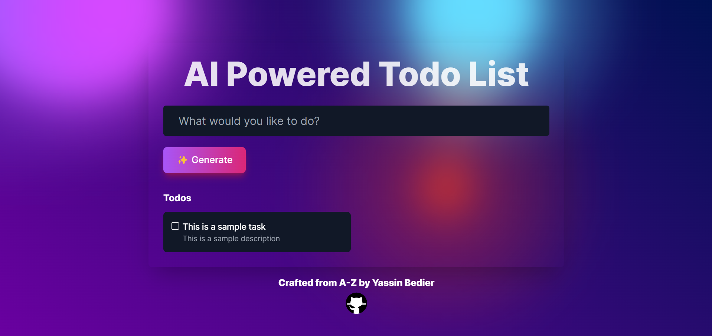

# AI Todo
AI Todo is an AI-powered to-do list application built with Next.js. It leverages OpenAI's API to intelligently generate, update, and manage tasks based on inputs.



## Features
- **Natural Language Input**: Simply input whatever you have on your mind into the text box at the top.
- **Intelligent Task Management**: Automatically creates task names and descriptions. Understands commands such as editing tasks ("first I want pizza, then nvm I want burger") and marking tasks as complete ("I just left BurgerKing").
- **AI Integration**: Powered by OpenAI's gpt-4-turbo for context-aware task processing.

## Requirements
- [NodeJS](https://nodejs.org/en/download/)
- [OpenAI API Key](https://platform.openai.com) (if you don't have one, just use our publically hosted demo)

## Usage
1. **Install dependencies**:
   ```
   npm install
   ```
2. **Add OpenAI API key to the environment file (`.env`)**:
   ```
   OPENAI_API_KEY=your_api_key_here
   ```
2. **Build & Run the Application**:
   ```
   npm run build
   npm start
   ```
3. **Using the Application**:
   - Access the application in your browser.
   - Enter tasks in the text box and interact with the AI-powered task manager.

## Support
If you need any help, encounter any issues, or just have a suggestion, feel free to open an issue in this repository.
Contributions are also more than welcome! Please fork the repository and submit a pull request.
